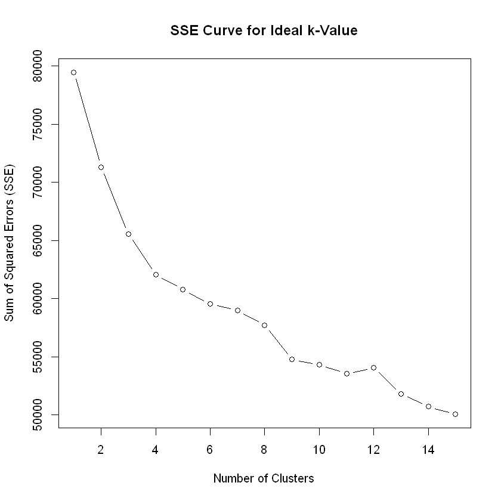

# Unsupervised Machine Learning

This exercise relies on the k-means algorithm to perform unsupervised machine learning for clustering via the R programming language.

## Prerequisites

* [Anaconda Distribution](https://www.anaconda.com/distribution/): Allows for R environment installation, including Jupyter setup
* [Jupyter](http://jupyter.org/): Web-based R notebook that can be launched via the Anaconda Navigator and natively reads .ipynb files
* [dplyr](https://dplyr.tidyverse.org/): This R package is for data manipulation and is part of the tidyverse R toolset
* [ade4](https://cran.r-project.org/web/packages/ade4/index.html): This R package can used for converting categorical data into numerical dummy data and for multivariate data analysis

## Data

The data used in this analysis reflects a historical snapshot of Sun Country Airlines data used for educational purposes. This repository will not cover the full data cleanup and sanitization process. We'll start with a pre-processed data set ready for clustering via R. 

## Running the code

This clustering exercise can be summarized into four major parts:
  1. Data preparation
  2. Converting categorical data into numerical data
  3. Analyzing k-means clusters via sum of squared errors (SSE) comparison 
  4. Cluster assignment in data set

To begin, install the dplyr and ade4 R packages for data manipulation and clustering (if not already installed).

```R
install.packages("dplyr")
library(dplyr)

install.packages("ade4")
library(ade4)
```

Then, download the file SC_data_CleanedUp.csv, assign it to "data" and then aggregate to the customer-trip level. Confirm aggregation was successful by testing if the to-be-assigned "customer_data" object is a data frame.


```R
data <- read.csv("SC_data_CleanedUp.csv")

customer_data <- data%>% 
  group_by(PNRLocatorID,CustID)%>%
  summarise(PaxName = first(PaxName),
            BookingChannel = first(BookingChannel), 
            amt = max(TotalDocAmt), 
            UFlyRewards = first(UFlyRewardsNumber), 
            UflyMemberStatus = first(UflyMemberStatus), 
            age_group = first(age_group), 
            true_origin = first(true_origin), 
            true_destination = first(true_destination), 
            round_trip = first(round_trip), 
            group_size = first(group_size), 
            group = first(group), 
            seasonality = first(Seasonality), 
            days_pre_booked = max(days_pre_booked))

is.data.frame(customer_data)

dim(customer_data)
```


TRUE
17946
15

Remove unnecessary variables (encrypted names, customer IDs, etc.). Normalize the amt, days_pre_booked, and group_size variables.


```R
clustering_data <- subset(customer_data,select = -c(PNRLocatorID,CustID,PaxName,UFlyRewards))

normalize <- function(x){
  return ((x - min(x))/(max(x) - min(x)))}

clustering_data = mutate(clustering_data,
            amt = normalize(amt),
            days_pre_booked = normalize(days_pre_booked), 
            group_size = normalize(group_size))
```

Since the k-means clustering algorithm works only with numerical data, we need to convert each of the categorical factor levels into numerical dummy variables ("0" or "1"). The ade4 package will be used to convert the categorical data into these numerical dummy variables.


```R
clustering_data <- as.data.frame(clustering_data)
clustering_data <- clustering_data %>% 
  cbind(acm.disjonctif(clustering_data[,c("BookingChannel","age_group","true_origin","true_destination",
                                          "UflyMemberStatus","seasonality")])) %>% ungroup()

#For cleanliness, remove the original, non-dummy-coded variables.
clustering_data<-clustering_data %>% select(-BookingChannel,-age_group,-true_origin,-true_destination,-UflyMemberStatus,-seasonality)
```

Now we can run k-means to gain a better understanding at the within SSE curve. We'll analyze SSE while comparing the impact on SSE from 1 to 15 clusters.

_Note: The sum of squared errors (or "SSE") is the sum of the squared differences between each observation and its cluster's mean. In the context of this clustering analysis, SSE is used as a measure of variation. If all observations within a cluster are identical, the SSE would be equal to 0. Modeling for "the lowest SSE possible" is not ideal as this results in model overfitting._


```R
SSE_curve <- c()
for (n in 1:15) {
  kcluster <- kmeans(clustering_data, n)
  sse <- sum(kcluster$withinss)
  SSE_curve[n] <- sse
}

plot(1:15, SSE_curve, type="b", main="SSE Curve for Ideal k-Value", xlab="Number of Clusters", ylab="Sum of Squared Errors (SSE)")
```





Given the plot above, the change in SSE decreases significantly after ~5 clusters. Let's select 5 clusters for the purpose of this customer segmentation.


```R
kcluster <- kmeans(clustering_data, 5)

kcluster$size
```

The following represents the size of each cluster:
3909  3384  2325  4656  3672

Lastly, add a new column with the cluster assignment into the CSV file, and call this field "Segment", for each observation in customer_data. After running the code below, this analysis will be completed.


```R
segment <- as.data.frame(kcluster$cluster)
colnames(segment) <- "Segment" 
customer_segment_data <- cbind.data.frame(customer_data, segment)
write.csv(customer_segment_data, "SC_customer_segment_data.csv")
```

## Acknowledgments

* [UC Irvine, Machine Learning Repository](https://archive.ics.uci.edu/ml/index.php)
* [UC Irvine, MS in Business Analytics curriculum](https://merage.uci.edu/programs/masters/master-science-business-analytics/curriculum.html)
* [University of Minnesota, Carlson Analytics Lab](https://carlsonschool.umn.edu/news/sun-country-airlines-engages-business-analytics-students-decode-data)
